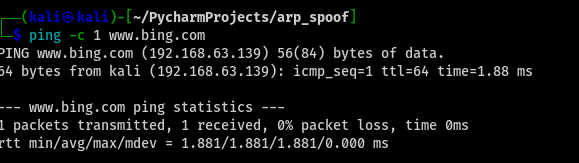

<h3>DNS SPOOF</h3>
<h4 style="color: red">Works locally in KL. Does not work with other VM</h4>
<h4>Do not know why and spent 4 hours trying to resolve so moving on and will redress at some future date.</h4>

Note to self, packet returned shows IP Spoofed

<b>DNS (Domain Name System):</b> Hierarchical, distributed service that translates human-readable domain names (like www.example.com) into machine-readable IP addresses (like 192.0.2.44) required to locate devices on the internet.

Often described as the <b>phonebook of the internet</b>, it has been an essential component of internet functionality since November 1983.

So, what ARP does for MAC and IP Addresses, DNS does for Domain Names and IP Addresses.

<b>DNS spoofing:</b> Also known as DNS cache poisoning, is a cyberattack where an attacker corrupts a DNS resolver's cache with false data to redirect users from legitimate websites to fraudulent ones. 

This manipulation causes the name server to return an incorrect IP address, 
tricking users into visiting fake sites that often mimic the 
original destination to steal sensitive information like 
login credentials or financial details.

<h4>Setup testing on our local computer.</h4>
<h4>Process:</h4>
<ol>
    <li>
        Create, in the terminal, an <b>OUTPUT</b> queue with a value of 0.

<b>sudo iptables -I OUTPUT -j NFQUEUE --queue-num 0 --queue-bypass
</b>

    </li>
  <li>
        Create an <b>INPUT</b> queue with a value of 0.

These are packets coming into your computer.

<b>sudo iptables -I INPUT -j NFQUEUE --queue-num 0 --queue-bypass
</b>

    </li>
</ol>
<h4>Finally found active http site for testing:</h4>

<b>http://testasp.vulnweb.com/</b>

Login Details: Username: <b>admin</b>.  Password: <b>none</b>

<h4>Remove the IP Table Rules.</h4>

When we are done testing be sure to remove the ip table rules.

<b>iptables --flush</b>

You can confirm the iptables flush by running: <b>sudo iptables -L -n</b>

And there will be zero rules under the chains (headings)

<h4>scapy.DNSRR</h4>

Look for the <b>qd</b>DNS Question Recorder (QR).  Which should have one or more answers <b>an</b>: rdata field contains the IP.

Run script: <b>sudo python dns_spoof.py</b> in one terminal window.

Run ping: <b>ping -c 1 www.bing.com, </b>in another window.  You should get the following with your IP

So, the target has requested to go to bing.com, but the 
IP we have returned is a spoofed IP and will take it somewhere
else.

<h4>Kali Linux create webserver and your own index page on your IP</h4>

When the user tries to navigate to www.bing.com they will be taken to our local page.

<h3>To Test on a Remote VM.</h3>
